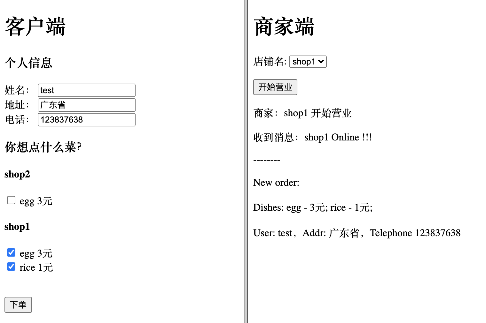

# Serverless Order System

[在线体验](https://order.yuga.chat)

基于 Serverless 的实时点餐系统.

## 项目简介

```
.
├── README.md           说明文件
├── package.json        npm 配置文件
├── postgresql          postgresql 数据库组件配置
├── scripts             项目脚本文件
├── server              后端服务
├── vpc                 vpc 组件配置
├── website             前端页面
└── websocket           websocket 服务
```

项目使用到的云端资源：

```
VPC         - 私有网络
PostgreSQL  - Serverless PostgreSQL 数据库
COS         - 对象存储
SCF         - 云函数
API GW      - API 网关
```

## 使用

克隆项目:

```bash
$ sls init order-system
```

## 部署

部署需要先配置腾讯云鉴权信息，复制 `.env.example` 为 `.env`，然后配置正确的腾讯云密钥的 `TENCENT_SECRET_ID` 和 `TENCENT_SECRET_KEY`。

项目下的子项目之间存在依赖关系：

```
vpc <- postgresql <- websocket <- server <- website
```

因此你会发现在 `package.json` 中存在各个子项目部署的命令，比如：

```bash
$ npm run deploy:website
```

当然你可以不用考虑这些，也可以直接一键部署所有，只需要执行:

```bash
$ npm run depoy
```

## 本地开发

第一次部署完成后，如果想要本地开发，可以将 `website` 目录中的 `/env.example.js` 复制为 `env.js`，然后将部署成功地 `server` 的 url 配置为 `apiUrl`，然后将 `websocket` 的 url 配置为 `wsUrl`。如下：

```js
window.env = {};

window.env.wsUrl = 'wss://service-xxxx-xxx.bj.apigw.tencentcs.com';
window.env.apiUrl = 'https://service-xxx-xxx.bj.apigw.tencentcs.com/release/';
```

然后启动前端页面：

```bash
$ npm run dev
```

在浏览器中访问 `http://127.0.0.1:8080` 如下：

<center>

</center>

## 注意 ⚠️⚠️⚠️

前端静态托管的配置 `website/serverless.yml` 中，配置了 `hosts` 为 CDN 加速域名相关配置，如果不需要 CDN 可以直接将其中的 `hosts` 配置删除。

## License

MIT License

Copyright (c) 2020 Yuga Sun
